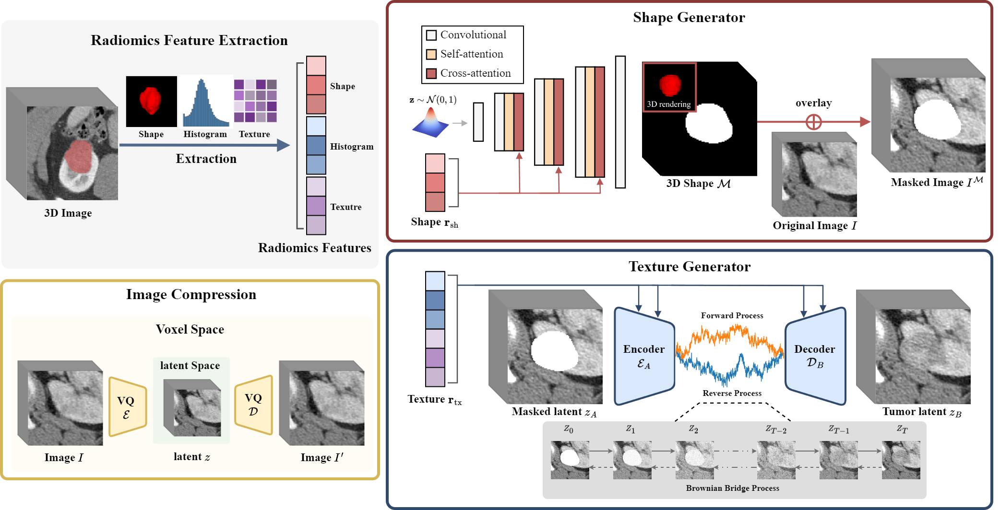

# Tumor Synthesis conditioned on Radiomics

Tumor Synthesis conditioned on Radiomics [Jonghun Kim<sup>1</sup>], [Inye Na<sup>1</sup>], [Eunsook ko<sup>2,3</sup>], [Hyunjin Park<sup>1</sup>] <br>

<sup>1</sup>Department of Electrical and Computer Engineering Sungkyunkwan University, Suwon, Korea <br>

<sup>2</sup> Department of Radiology and Center for Imaging Science, Samsung Medical Center, Suwon, Korea <br>

<sup>3</sup> Sungkyunkwan University School of Medicine, Seoul, Korea <br>


# Overview

This repository contains the code for Tumor Synthesis conditioned on Radiomics.

 The model architecture is illustrated below: 




Our code was written by applying VQ-GAN, GigaGAN and BBDM into 3D methods. 

We would like to thank those who have shared their code. 

Thanks to everyone who contributed this works and codes.

- [Taming Transformers for High-Resolution Image Synthesis](https://github.com/CompVis/taming-transformers) 
- [Scaling up GANs for Text-to-Image Synthesis](https://github.com/lucidrains/gigagan-pytorch)

- [BBDM: Image-to-image Translation with Brownian Bridge Diffusion Models](https://github.com/xuekt98/BBDM)

<br>

## Feature Extraction

We used pyradiomics to extract radiomics features. 

For more details on pyradiomics, please refer to the following document. 

https://pyradiomics.readthedocs.io/en/latest/index.html


## Citation

```
@InProceedings{Kim_2025_WACV,
    author    = {Kim, Jonghun and Na, Inye and Ko, Eun Sook and Park, Hyunjin},
    title     = {Tumor Synthesis Conditioned on Radiomics},
    booktitle = {Proceedings of the Winter Conference on Applications of Computer Vision (WACV)},
    month     = {February},
    year      = {2025},
    pages     = {3635-3646}
}
```

