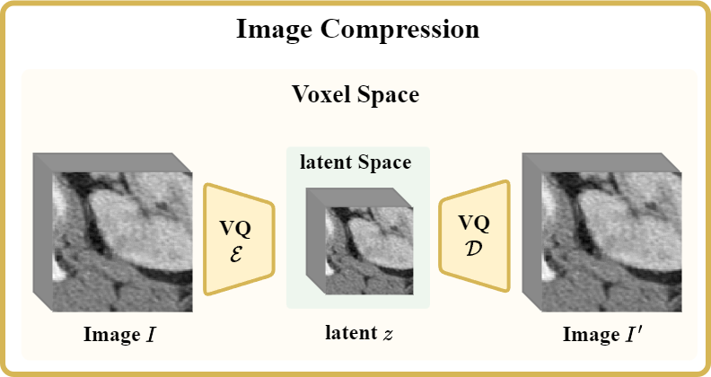

# 3D Image Compression with VQ-GAN

## Overview



3D Image compression with VQ-GAN for efficient training

<br>

## Train

Training can be started by running

```
CUDA_VISIBLE_DEVICES=<GPU_ID> python train.py --distributed --save_checkpoint --logdir vqgan --max_epochs 2000 --batch_size 1 --num_embeddings 2048 --embedding_dim 2 --optim_lr 2e-6
```

<br>

## Acknowledgement

Thanks to everyone who contributed code and models.

- [Taming Transformers for High-Resolution Image Synthesis](https://github.com/CompVis/taming-transformers)

- [Project MONAI](https://github.com/Project-MONAI)