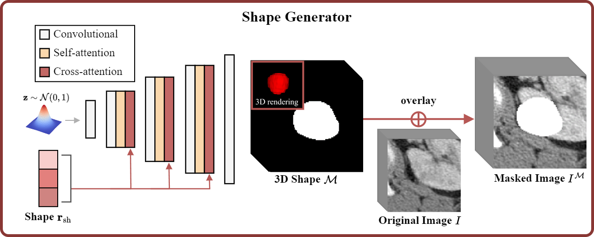

# Shape Generator


## Overview



The shape generator takes radiomics shape features as input and generates 3D tumor masks. 

Our code has expanded the [GigaGAN](https://github.com/lucidrains/gigagan-pytorch) to 3D and uses radiomics features as the condition instead of the text condition.


## Requirements

```commandline
pip install gigagan-pytorch
pip install monai==1.2.0
```


## Train

We generate the shape in two steps. 

We create a tumor mask at low resolution along with the shape feature.

```commandline
python train.py
```

Then, We perform 4x upsampling with

```commandline
python train-up.py
```


## Acknowledgement

Our Code  is implemented based on GigaGAN

[Scaling up GANs for Text-to-Image Synthesis](https://github.com/lucidrains/gigagan-pytorch)