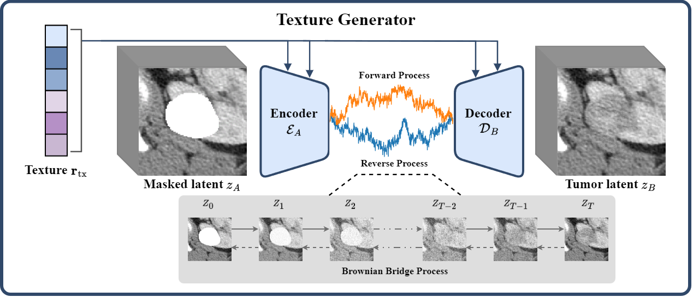

# Texture Generator


## Overview



The texture generator takes radiomics texture features as input and fills the masked areas of 3D medical images with tumors corresponding to those texture features. 

When radiomics features are not provided, it fills the masked areas with normal tissue. 

Our code has been modified to extend [BBDM](https://github.com/xuekt98/BBDM) to 3D and uses radiomics features as the condition instead of the traditional text condition.


## Requirements

```commandline
cond env create -f environment.yml
conda activate BBDM
pip install monai==1.2.0
```

## Run

```commandline
sh shell/shell.sh
```

## Acknowledgement

Our Code  is implemented based on BBDM

[BBDM: Image-to-image Translation with Brownian Bridge Diffusion Models](https://github.com/xuekt98/BBDM)